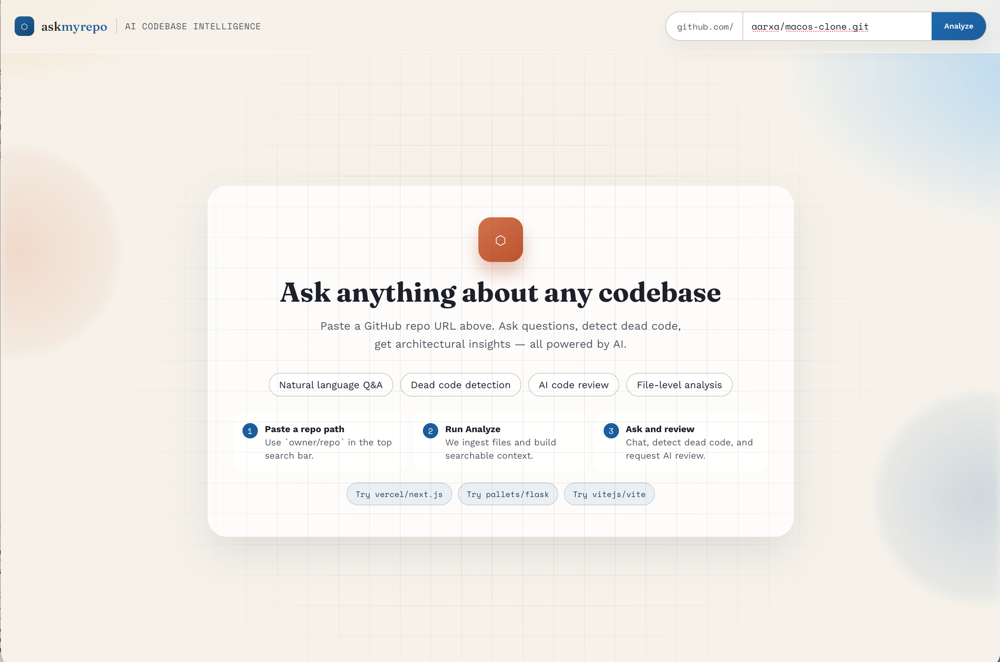
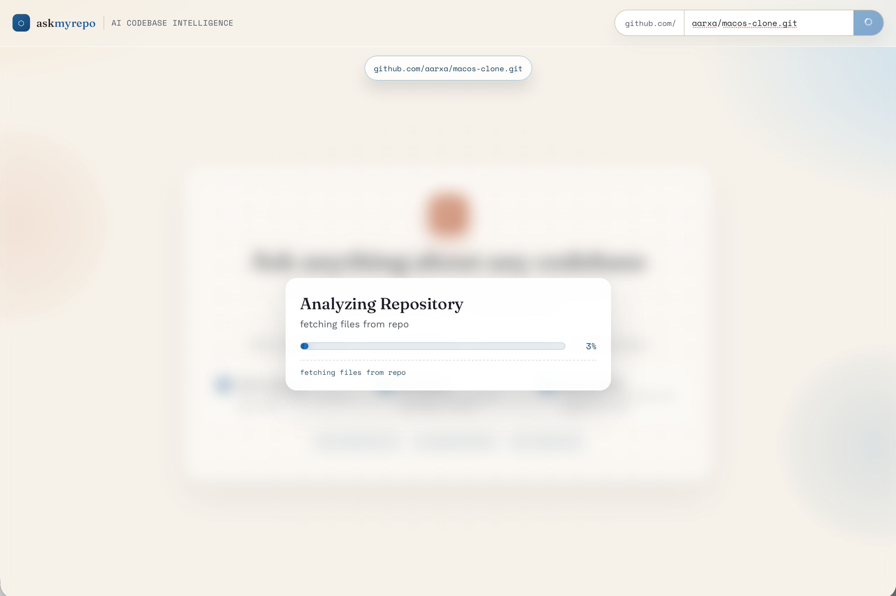
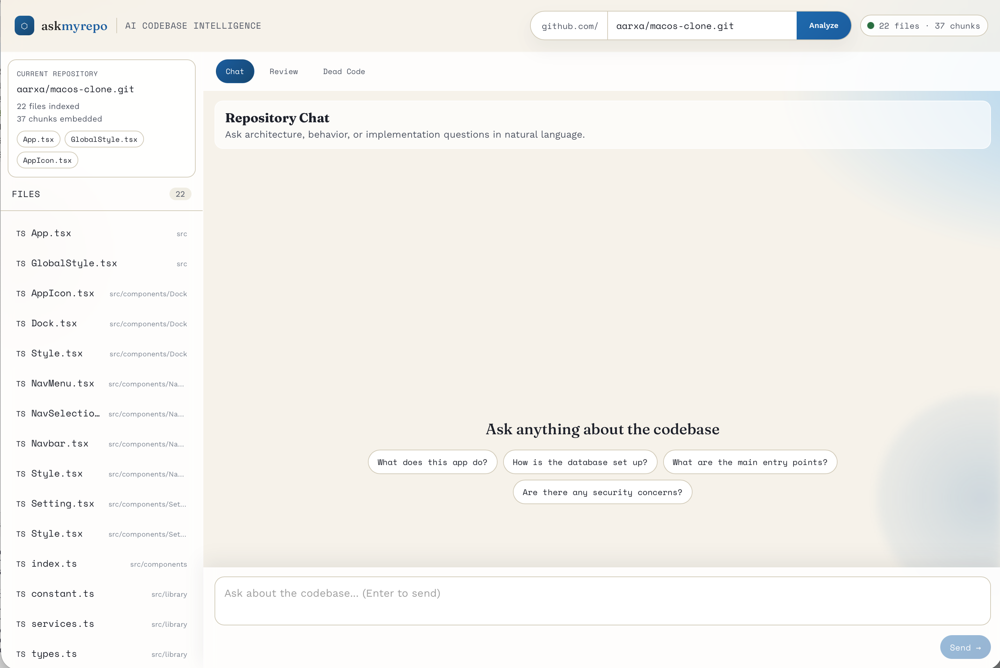
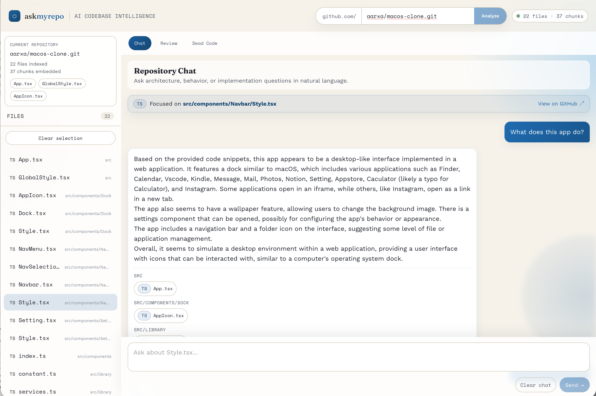

# Ask My Repo

Ask My Repo is a full-stack AI code intelligence app that ingests a public GitHub repository, builds semantic code context, and lets you interact with the codebase through natural language.

It combines:
- repository ingestion and chunking
- vector search over code
- conversational repository Q&A
- dead-code scanning
- automated architecture and quality review

## Project Status

Core functionality is working end-to-end in local and deployed environments.

The UI is still being actively refined. Current visual layout and interactions are functional, but ongoing UI polish and UX improvements are in progress.

## What You Can Do

- Analyze a GitHub repository from `owner/repo` input
- Ask implementation and architecture questions in chat
- View file-linked sources used to answer each question
- Run dead code detection (vulture-based scan)
- Generate AI improvement suggestions (architecture, quality, security)
- Browse indexed files and scope chat to a selected file

## How It Works

1. Repository ingestion
- Fetches code files from GitHub via API
- Filters by known source-code extensions
- Splits files into overlapping chunks

2. Embedding and indexing
- Creates embeddings with `text-embedding-3-small`
- Stores vectors and metadata in ChromaDB

3. Retrieval and answer generation
- Performs semantic search against indexed chunks
- Builds grounded prompt context from matched files
- Generates final answer with `gpt-4o`

4. Extra analysis modes
- Dead code scan with `vulture`
- Repo-level improvement report with `gpt-4o`

## Architecture

Frontend:
- React + Vite
- Axios for API communication
- Ingestion progress overlay and multi-tab workspace (Chat, Review, Dead Code)

Backend:
- FastAPI
- ChromaDB persistent client
- GitHub API (PyGithub) for repo content ingestion
- OpenAI API for embeddings and chat completions
- In-memory job tracking for ingestion progress

Storage:
- Chroma local persistence path configurable with `CHROMA_PATH`

## Repository Structure

```text
.
├── backend/
│   ├── main.py            # FastAPI app + routes
│   ├── ingestion.py       # GitHub fetch, chunk, embed, index
│   ├── retrieval.py       # semantic retrieval + Q&A
│   ├── analysis.py        # dead code + improvements
│   ├── requirements.txt
│   └── .env.example
├── frontend/
│   ├── src/App.jsx        # main UI workflow
│   ├── package.json
│   └── .env.example
├── DEPLOYMENT.md          # Render + Netlify deployment guide
└── netlify.toml
```

## API Surface

- `GET /`
  - Health/status check

- `POST /ingest`
  - Starts ingestion and embedding pipeline for a GitHub repo

- `GET /ingest-status/{job_id}`
  - Returns live ingestion progress updates

- `POST /ask`
  - Answers repository questions with source-grounded context

- `POST /dead-code`
  - Runs static dead-code scan on the target repo

- `POST /improvements`
  - Returns architecture/code quality/security suggestions

- `GET /files/{collection_id}`
  - Returns indexed file list with source URLs

## Environment Variables

Backend:
- `OPENAI_API_KEY` (required)
- `GITHUB_TOKEN` (required)
- `CORS_ORIGINS` (recommended for deployment)
- `CHROMA_PATH` (optional; defaults to `./chroma_store`)
- `PYTHON_VERSION` (Render deployment; set to `3.11.11`)

Frontend:
- `VITE_API_URL` (deployment URL of backend API)

## Local Development

Backend:
```bash
cd backend
python -m venv .venv
source .venv/bin/activate
pip install -r requirements.txt
uvicorn main:app --host 0.0.0.0 --port 8000 --reload
```

Frontend:
```bash
cd frontend
npm install
npm run dev
```

## Deployment

Production setup in this repository is documented in:

- [DEPLOYMENT.md](./DEPLOYMENT.md)

Current deployment target:
- backend: Render
- frontend: Netlify

## Limitations and Notes

- Free Render services can spin down after inactivity (cold starts)
- Free Render does not provide persistent disk, so indexed Chroma data may be lost after restart/redeploy
- Ingestion progress state is in-memory and instance-local
- Large repositories may take time due to chunking and embedding workload

## Screenshots

### Home and Repository Input



### Ingestion Progress Overlay



### Chat Workspace





### Dead Code Report


### AI Review Output

UI screenshot for this section is being added next.

## Current Focus

- UI cleanup and interaction polish
- Better loading and error states
- Improved discoverability of file-scoped chat context
